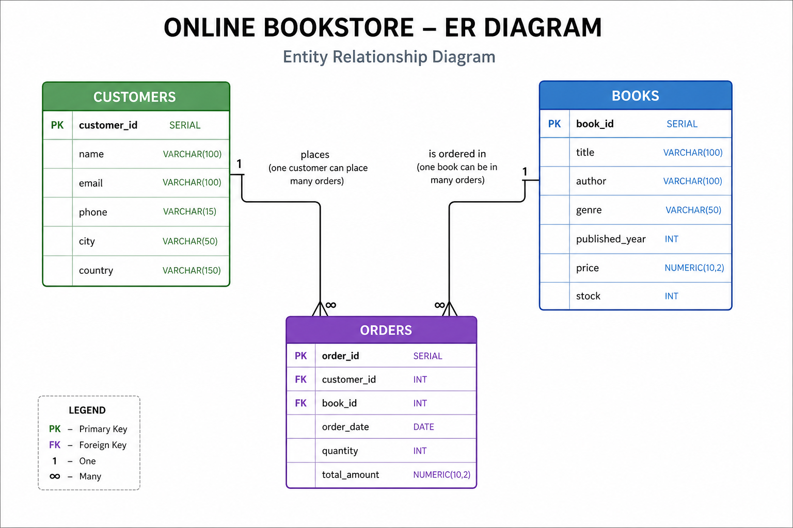
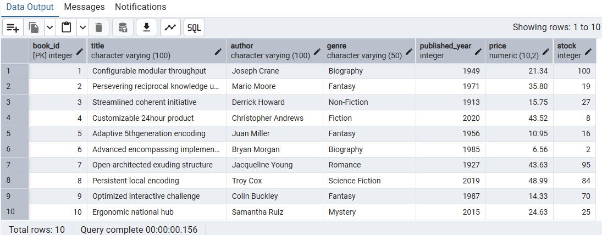
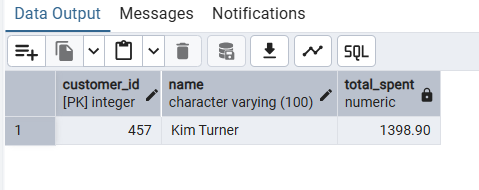
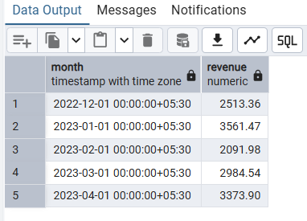

# 📚 Online Bookstore SQL Project

## 📌 Overview

This project analyzes bookstore sales data using PostgreSQL to generate business insights.

## 🛠️ Tools Used

* PostgreSQL
* SQL

## 🗂️ Database Schema (ER Diagram)

This diagram shows relationships between Books, Customers, and Orders tables.

## 📊 Key Analysis

* Top-selling books
* Monthly revenue trends
* Customer behavior analysis
* Inventory insights

## 📸 Sample Output

## 📁 Project Structure

* SQL file (database + queries)
* Screenshots of results
* insights.md (business insights)
* ER diagram

## 🚀 How to Run

1. Create tables using SQL file
2. Import CSV data
3. Run queries

## 📊 Insights

Check `insights.md` for detailed analysis

