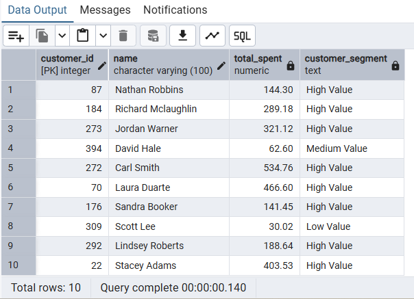

# 📚 Online Bookstore SQL Project

## 📌 Overview

This project analyzes bookstore sales data using PostgreSQL to generate business insights.

## 🚀 Project Highlights

* Built a relational database schema for bookstore operations
* Performed sales and customer analysis using SQL
* Identified top-performing books and revenue trends
* Applied joins, aggregations, and CASE statements for insights

This analysis helps in making data-driven decisions for sales and inventory management.

## 🛠️ Tools Used

* PostgreSQL
* SQL

## 🗂️ Database Schema (ER Diagram)

The ER diagram illustrates a relational schema where Orders act as a bridge between Customers and Books, enabling transactional analysis.

## 📊 Key Analysis

* Top-selling books
* Monthly revenue trends
* Customer behavior analysis
* Inventory insights

## 📸 Sample Output

## 📁 Project Structure

* SQL file (database + queries)
* Screenshots of results
* insights.md (business insights)
* ER diagram

## 🚀 How to Run

1. Create tables using SQL file
2. Import CSV data
3. Run queries

## 📊 Insights

Check [Insights](insights.md) for detailed analysis

